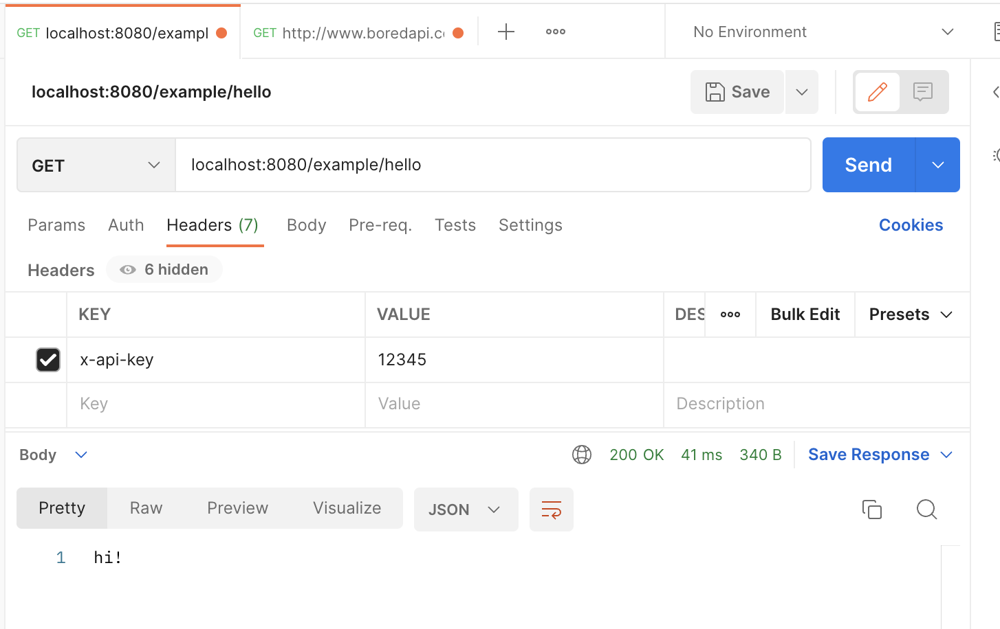

# spring-boot-examples-api-key-auth

## Examples on how to secure a REST API with an API key.

0. First, set up a minimalistic Spring Boot app (`pom.xml`,`ExampleApplication.java`, `ExampleController.java`).
1. Test the endpoint at [localhost:8080/example/hello](localhost:8080/example/hello)
2. Second, add the security dependency (`pom.xml`) and the security config (`application.yaml`, `SecurityConfig.java`).
3. Restart the app. Access to [localhost:8080/example/hello](localhost:8080/example/hello) should be forbitten now. Next, send your API key in the request header and try again. 
